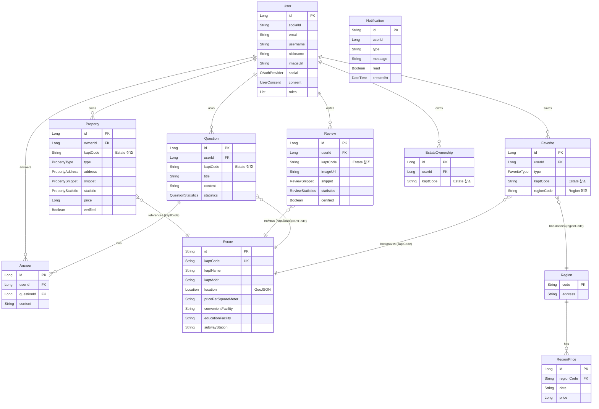
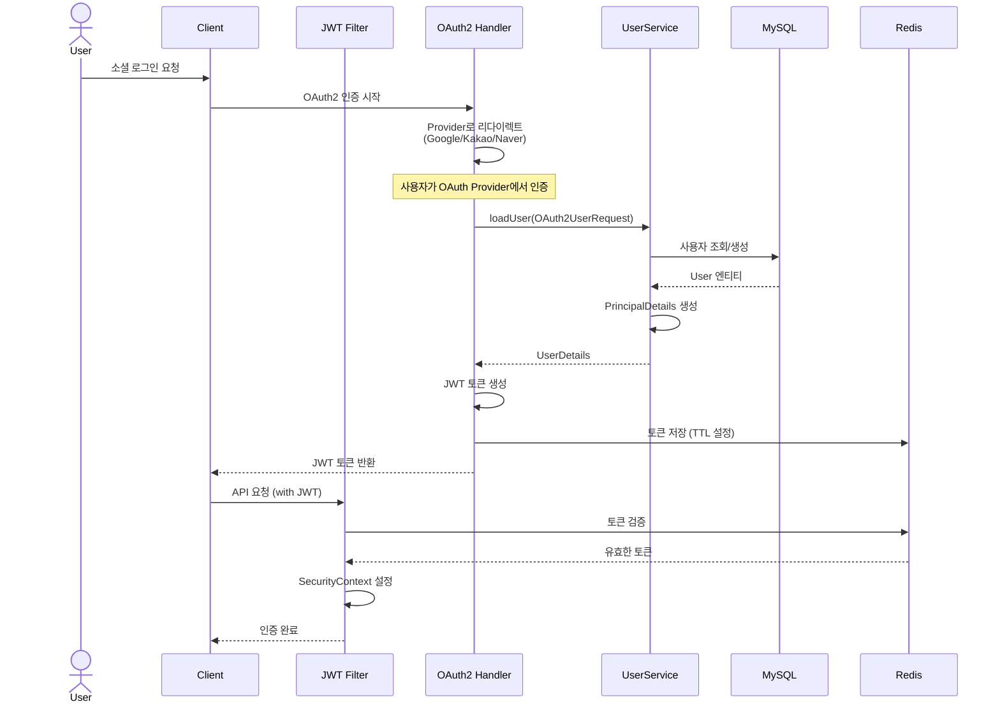
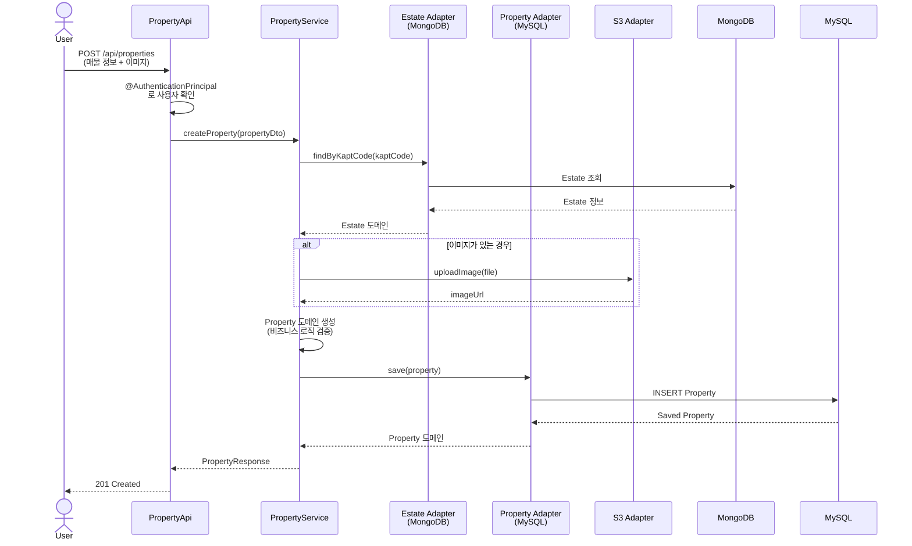
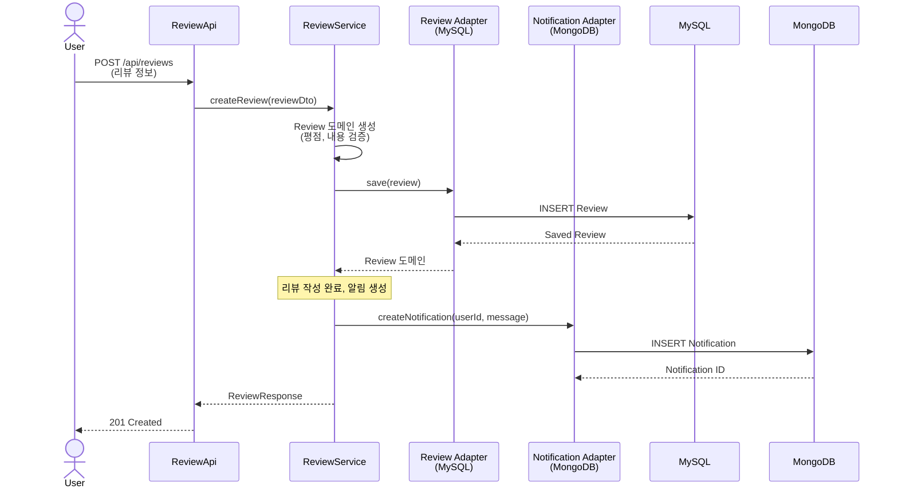
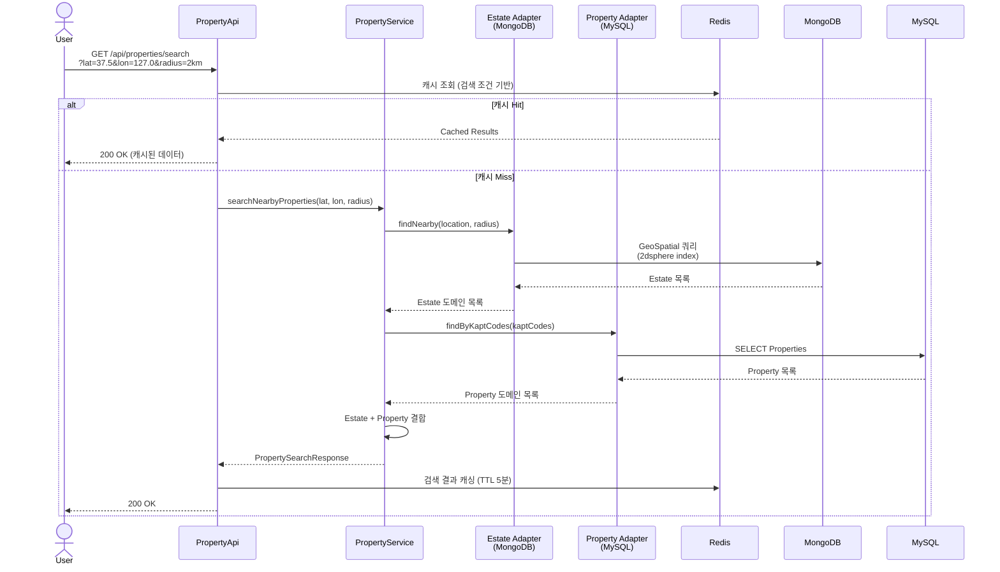
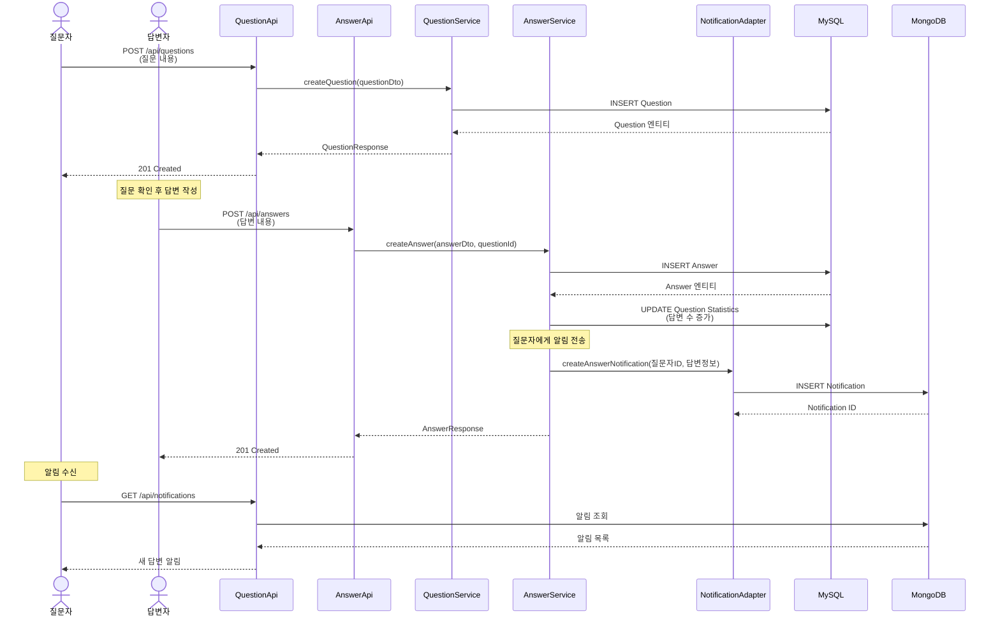

# ZipTe Platform

> 헥사고날 아키텍처 기반의 확장 가능한 부동산 플랫폼 백엔드

## 프로젝트 소개

ZipTe는 Spring Boot와 헥사고날 아키텍처(Ports and Adapters)를 적용한 부동산 플랫폼입니다.
비즈니스 로직과 인프라 관심사를 철저히 분리하여 유지보수성과 테스트 용이성을 극대화했습니다.

### 주요 특징

- **헥사고날 아키텍처**: 도메인 중심 설계로 비즈니스 로직의 독립성 보장
- **멀티 데이터베이스**: MySQL(관계형 데이터) + MongoDB(문서형 데이터) 하이브리드 구조
- **OAuth2 인증**: Google, Kakao, Naver 소셜 로그인 통합
- **AI 통합**: Gemini API를 활용한 스마트 기능
- **클라우드 스토리지**: AWS S3 기반 파일 관리
- **실시간 캐싱**: Redis 기반 세션 및 데이터 캐싱

## 기술 스택

### Backend
- **Language**: Java 17
- **Framework**: Spring Boot 3.4.4
- **Build Tool**: Gradle
- **Security**: Spring Security + JWT + OAuth2

### Database
- **MySQL**: 사용자, 매물, 리뷰 등 관계형 데이터
- **MongoDB**: 아파트 정보, 알림 등 문서형 데이터
- **Redis**: 세션 관리 및 캐싱

### Infrastructure
- **Cloud Storage**: AWS S3
- **AI Integration**: Google Gemini API
- **Documentation**: Swagger/OpenAPI

### Testing & Quality
- **Testing**: JUnit 5
- **Code Coverage**: Jacoco
- **Logging**: AOP-based Logging

## 아키텍처

### 헥사고날 아키텍처 (Ports and Adapters)

```
┌─────────────────────────────────────────────────────────┐
│                    Adapters (In)                        │
│                  REST API Controllers                   │
│              (PropertyApi, UserApi, etc.)               │
└────────────────────┬────────────────────────────────────┘
                     │
┌────────────────────▼────────────────────────────────────┐
│              Application Layer                          │
│                                                          │
│  ┌──────────────────────────────────────────────────┐  │
│  │         Use Cases (In Ports)                     │  │
│  │  CreatePropertyUseCase, GetUserUseCase, etc.    │  │
│  └──────────────────┬───────────────────────────────┘  │
│                     │                                   │
│  ┌──────────────────▼───────────────────────────────┐  │
│  │              Services                            │  │
│  │  PropertyService, UserService, etc.             │  │
│  └──────────────────┬───────────────────────────────┘  │
│                     │                                   │
│  ┌──────────────────▼───────────────────────────────┐  │
│  │         Out Ports                                │  │
│  │  SavePropertyPort, LoadEstatePort, etc.         │  │
│  └──────────────────┬───────────────────────────────┘  │
└────────────────────┬────────────────────────────────────┘
                     │
┌────────────────────▼────────────────────────────────────┐
│                  Adapters (Out)                         │
│  ┌─────────────┐  ┌─────────────┐  ┌────────────────┐  │
│  │ JPA Adapter │  │Mongo Adapter│  │External Adapter│  │
│  │   (MySQL)   │  │ (MongoDB)   │  │   (S3, AI)     │  │
│  └─────────────┘  └─────────────┘  └────────────────┘  │
└─────────────────────────────────────────────────────────┘
                     │
┌────────────────────▼────────────────────────────────────┐
│                  Infrastructure                         │
│         MySQL, MongoDB, Redis, S3, Gemini              │
└─────────────────────────────────────────────────────────┘
```

### 계층별 역할

#### 1. 도메인 계층 (`domain/`)
- 순수 비즈니스 엔티티
- 프레임워크 의존성 제로
- 예시: `Property`, `Estate`, `User`, `Review`

#### 2. 애플리케이션 계층 (`application/`)
- **In Ports**: 유스케이스 인터페이스 정의
- **Out Ports**: 외부 의존성 인터페이스 정의
- **Services**: 비즈니스 로직 구현

#### 3. 어댑터 계층 (`adapter/`)
- **In Adapters**: REST API 컨트롤러
- **Out Adapters**:
  - JPA (MySQL 영속성)
  - MongoDB (문서 저장소)
  - External (S3, AI 통합)

## 프로젝트 구조

```
src/main/java/com/zipte/platform/
├── server/
│   ├── domain/              # 도메인 엔티티
│   │   ├── Property.java
│   │   ├── Estate.java
│   │   ├── User.java
│   │   └── ...
│   ├── application/         # 애플리케이션 계층
│   │   ├── in/             # Use Case 인터페이스
│   │   ├── out/            # Port 인터페이스
│   │   └── service/        # 비즈니스 로직
│   └── adapter/            # 어댑터 계층
│       ├── in/web/         # REST Controllers
│       └── out/
│           ├── jpa/        # MySQL 어댑터
│           ├── mongo/      # MongoDB 어댑터
│           └── external/   # 외부 서비스 어댑터
├── core/                   # 공통 설정 및 유틸리티
│   ├── config/
│   ├── exception/
│   ├── response/
│   └── security/
└── ZipTePlatformApplication.java
```

## 주요 도메인

| 도메인 | 설명 | 저장소 |
|--------|------|--------|
| **Estate** | 아파트 부동산 목록 | MongoDB |
| **Property** | 사용자 생성 매물 항목 | MySQL |
| **User** | 사용자 계정 (OAuth2) | MySQL |
| **Favorite** | 관심 매물 | MySQL |
| **Review** | 매물 리뷰 | MySQL |
| **Notification** | 알림 | MongoDB |
| **Region** | 지역 및 가격 정보 | MySQL |
| **Question** | 커뮤니티 질문 | MySQL |
| **Answer** | 커뮤니티 답변 | MySQL |

## 데이터 모델

### ERD (Entity Relationship Diagram)



### 데이터베이스 분리 전략

#### MySQL (관계형 데이터)
- **사용자 및 인증**: User, UserConsent, UserWeight
- **매물 거래**: Property, Review, Favorite
- **커뮤니티**: Question, Answer
- **지역 정보**: Region, RegionPrice
- **ACID 트랜잭션이 중요한 비즈니스 로직**

#### MongoDB (문서형 데이터)
- **부동산 정보**: Estate (GeoJSON 위치 정보 포함)
- **알림 시스템**: Notification (읽음/안읽음 상태 관리)
- **유연한 스키마가 필요한 데이터**
- **지리 기반 검색 (GeoSpatial Index)**

## 시퀀스 다이어그램

### 1. OAuth2 로그인 프로세스



### 2. 매물 등록 프로세스



### 3. 리뷰 작성 및 알림 프로세스



### 4. 매물 검색 프로세스 (지리 기반)



### 5. 커뮤니티 Q&A 프로세스



## 시작하기

### 사전 요구사항

- Java 17 이상
- Docker & Docker Compose
- Gradle 7.x 이상

### 로컬 환경 구성

1. 저장소 클론
```bash
git clone https://github.com/ZipTe/ZipTe_Hexagon.git
cd ZipTe_Hexagon/platform
```

2. 인프라 서비스 실행
```bash
docker-compose -f compose/docker-compose.yml up -d
```

3. 애플리케이션 빌드 및 실행
```bash
# 빌드
./gradlew build

# 실행 (local 프로필)
./gradlew bootRun
```

### 테스트 실행

```bash
# 전체 테스트
./gradlew test

# 특정 테스트 클래스
./gradlew test --tests "com.zipte.platform.server.adapter.in.web.UserApiTest"

# 커버리지 리포트 생성
./gradlew jacocoTestReport

# 커버리지 검증
./gradlew jacocoTestCoverageVerification
```

## API 문서

애플리케이션 실행 후 Swagger UI에서 API 문서 확인 가능:

```
http://localhost:8080/swagger-ui.html
```

## 네이밍 컨벤션

### Port & Adapter 패턴
- Use Case: `{Action}{Entity}UseCase` (예: `CreatePropertyUseCase`)
- Port: `{Action}{Entity}Port` (예: `SavePropertyPort`)
- Service: `{Entity}Service` (예: `PropertyService`)
- Adapter: `{Entity}PersistenceAdapter` 또는 `{Purpose}Adapter`
- API: `{Entity}Api` (예: `PropertyApi`)

### 커밋 메시지 규칙
```
✨ feat/   : 새로운 기능
🐛 fix/    : 버그 수정
📖 docs/   : 문서화
✅ test/   : 테스팅
♻️ refactor/: 리팩토링
```

## 주요 기능

### 1. 인증 및 보안
- OAuth2 소셜 로그인 (Google, Kakao, Naver)
- JWT 기반 세션 관리
- Redis를 통한 토큰 저장

### 2. 매물 관리
- 매물 등록, 수정, 삭제
- 관심 매물 저장
- 매물 검색 및 필터링
- 이미지 업로드 (S3)

### 3. 리뷰 시스템
- 매물 리뷰 작성
- 평점 관리
- 리뷰 조회 및 페이지네이션

### 4. 알림
- 실시간 알림 (MongoDB)
- 알림 읽음 처리

### 5. AI 통합
- Gemini API를 활용한 스마트 기능

## 코드 품질 관리

### Jacoco 커버리지
- DTO, Request, Response, Mapper는 커버리지에서 제외
- Exception, Config 클래스 제외
- 비즈니스 로직에 집중한 커버리지 측정

### 로깅
- AOP 기반 메서드 로깅
- 실행 시간 추적
- 진입/종료 로그

### 예외 처리
- 글로벌 예외 핸들러
- 커스텀 예외 체계
- 일관된 에러 응답 형식 (`ApiResponse<T>`)

## 기술적 의사결정

### 헥사고날 아키텍처 선택 이유
1. **비즈니스 로직의 독립성**: 프레임워크나 DB 변경에 영향받지 않는 도메인 계층
2. **테스트 용이성**: 포트 인터페이스를 통한 쉬운 모킹
3. **확장성**: 새로운 어댑터 추가가 용이한 구조
4. **유지보수성**: 명확한 계층 분리로 코드 이해도 향상

### 멀티 데이터베이스 전략
- **MySQL**: ACID 특성이 중요한 트랜잭션 데이터 (매물, 사용자, 리뷰)
- **MongoDB**: 유연한 스키마가 필요한 데이터 (아파트 정보, 알림)
- **Redis**: 빠른 응답이 필요한 세션 및 캐시

## 라이선스

This project is licensed under the MIT License.
